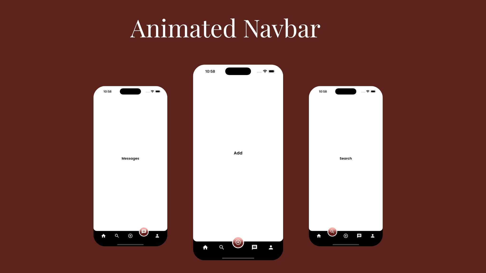

# Bottom Navbar with Animated Glass Morphism Icons

This screen features an elegant and interactive bottom navigation bar with glassmorphism effect on the selected icon. It includes smooth animations, icon transformations, and customizable design.

## ✨ Features

- 🎯 Animated Bottom Navigation Bar
- Icons float upward when selected
- Smooth transition animations

## 🧊 Glassmorphism Effect

- Applies blur and transparency only on the selected item
- Styled using BackdropFilter and ClipOval

## 🌙 Dark Background Compatibility

- Works best with gradient or image backgrounds

## 💡 Easily Extensible

- Add more icons, routes, and content sections

## 🧩 How It Works

- Each icon is wrapped in an AnimatedContainer that moves it upward when selected.
- A Stack combines the background blur using BackdropFilter and a semi-transparent gradient.
- ClipOval ensures the blur is confined to the circular icon area.

